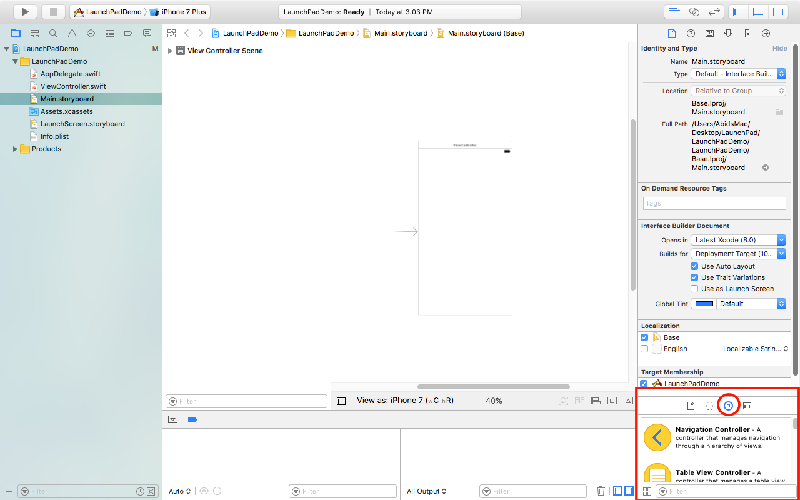
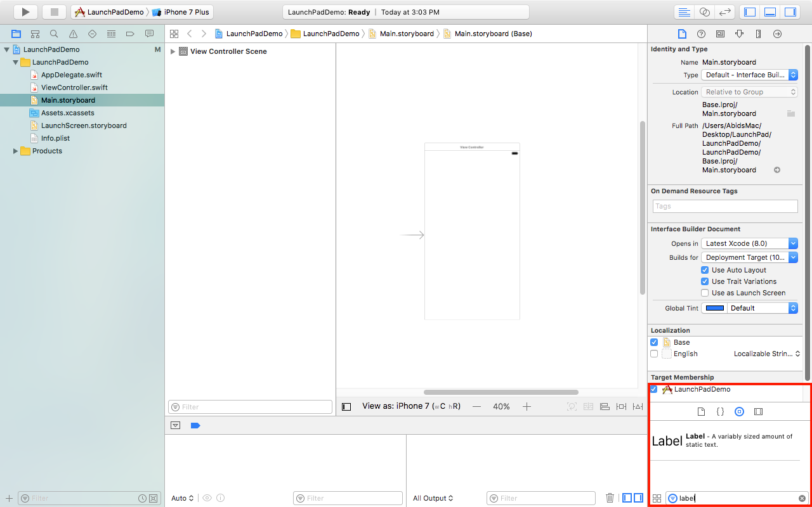
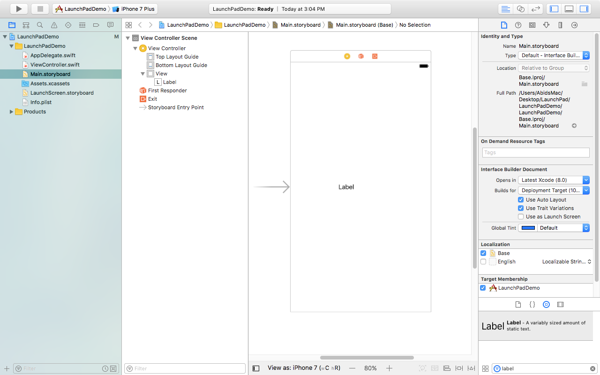
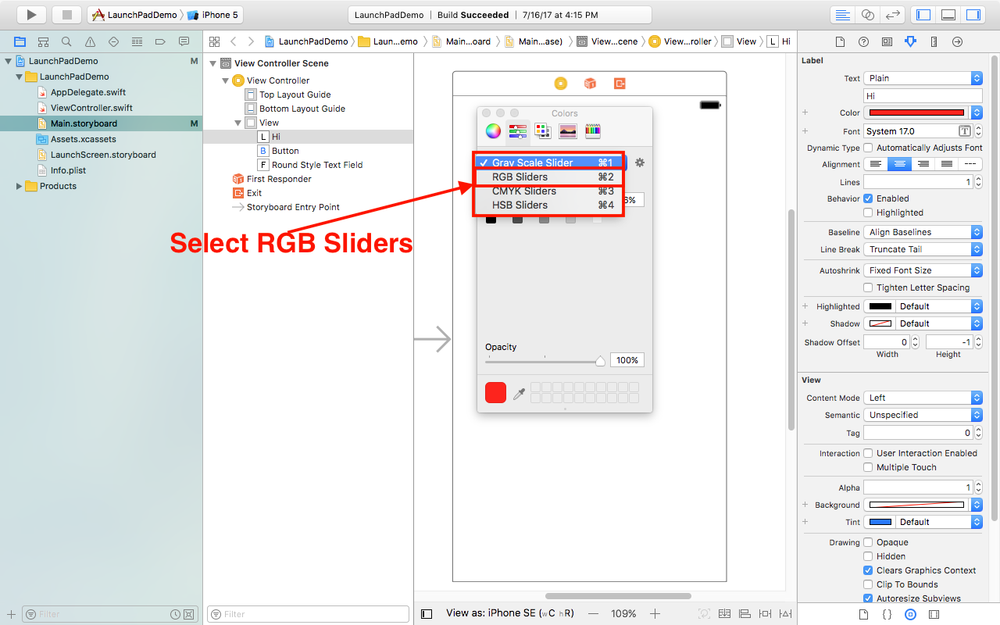

# Introduction to Interface Builder

Interface Builder or IB has been a part of Apple's development ecosystem. It has changed a lot since then and has made Xcode the beast it is today. The most recent iteration in Interface Builder was Storyboards. Storyboards were designed to make designing of UI (User Interface) much easier. Apple strongly recommends developers use Storyboards as opposed to programmatically creating their UI.

## Inserting basic UI elements such as Labels, buttons and text fields

To insert a label into our application all we have to do is simply search for a label and drag it into your view in storyboard.

Lets go ahead and do it

If you have made an Xcode project and are good to go. If you do not have an Xcode project set up, feel free to go look at the "Introduction to Xcode" guide and come back here when you’re done.

Once you have your project set up feel free to follow along these steps. 

We are going to set up a Label, Button and Text Field in our view so lets go on about it

### Adding a label

- First make sure that you are on the correct file open. We will be working on Main.storyboard.




- Second what you want to do is use the object library



- Once the object library is selected, search for label



- When you can see the label, simply drag it into the view 



Your screen should look like this when you’re done. If not then go back and follow through the steps again.

### Adding a Button

Setting or moving anything onto your screen simply translates to dragging it onto your view in storyboard from the object library like we did for the adding a label to our view above. 

- To start off, I'm going to move the label to the upwards to make room for the additional items that we are going to add to this view

- First, we will search for a button in the object library. Do note that I moved the label upwards.



- Second we will simply drag it into our view



And there you go you just added a button to your application.

### Adding a Text Field

Adding a Text Field to is also the same, simply search for it and drag it. I'll let you do this part. At the end your screen should look like the following


## Using Inspector to set various properties of UI elements

Now that we have added the item or UI Elements that we wanted, lets customize them and make them ours.

To customize any items through storyboard we will be using the attributes inspector which can be accessed in the inspector pane of Xcode's screen.




The attributes inspector is the tab on the inspector `once a UI element such as a label is selected`, that looks like a pencil.


Let’s change the look of the label and the button

### Modifying Attributes of the Label

- First let’s make sure that we have clicked on both the label and the attributes inspector. Refer to the previous picture if you’re lost. The label should be highlighted and the attributes inspector (the pencil) should be blue
- Now let’s change the color of the label, apple does suggest a couple of colors for you to use but you can always use the color picker or use RGB values for a certain color

Using the color picker

To access the color picker we need to select color attribute in the attributes inspector for the label




Then select other



Now you should be seeing a screen like this: 




Click on the color wheel and then simply select a color





If you want to use an RGB/HEX value for a color then go to the color sliders and enter in your values.

- First select the color sliders tab



- Then select RGB colors from the dropdown menu



- Finally feel free to enter in the RGB/HEX values or use the sliders




Once done you should see the label's text color change.



To change the text of the label simply click on the text field below the title label, lets change it to "Hi"



## Setting background colors and images using Image Views

### Setting the background of UI Elements

#### Modifying Attributes of the Button

Okay we are now going to do two things:

- First, we are going to set the buttons text color to white. Setting this is done the same way as the label so I'll let you do that on your own
- Second we are going to change the background color of the button. Setting the background color of the button is quite similar to setting the color of the text.

Make sure that the button is selected and scroll down to the inspector till you see background. Simply click on the drop down and select the `Light Gray Color`




Once done, this is what your screen should look like. 





### Using Image Views

We are going to be using our image view as the background for our view. We can either give it a background color like we did for our button or an image and make use of the fact that it’s an image view. 


First, we will be needing an image.

Lets use this [image] ( https://static.pexels.com/photos/1526/dark-blur-blurred-gradient.jpg)

Once you have the image,

You want to go to your Assets.xcassets. This is where you will keep most of your icons and other images. For now lets move the background [image] ( https://static.pexels.com/photos/1526/dark-blur-blurred-gradient.jpg) that we just downloaded into our Assets.

Follow the instructions in the picture below



Once you’re done adding the image to the image to your Assets folder, it’s time for us to add an image view. 

Let’s got back to Main.StoryBoard and drag in an Image View


To drag one in simply search for an image view and drag it onto our view.




Resize the image view so that it takes up the entire screen




Now that we have our image view placed lets give it an image. Make sure the image view is selected an select our "background" image from the dropdown



If you don’t remember naming anything background then go back to the part when we added the image into our Assets in Xcode by simply dragging it in.


When you have, the image selected this is what your screen should look like. 




## Selecting Keyboard types

When designing applications, you’re bound to come into a situation where you only want a certain form of input from the user. For example, when you’re working on a tip calculator application you want to ensure that your user does not enter any words and only enters in numbers into our app. Currently we are using Text Fields for user input. If you select a Text Field, it has an attribute called `Keyboard Type.` This attribute has a set of values for you to choose from each representing a type of keyboard available in IOS.



Now it makes sense for us to use a decimal or number pad when the user in entering in the price of something into our application.
Similarly, if you’re taking in the users email during the sign-up process of your application than it would be best to use the Email Addresses Keyboard type and so on. 

Let see what our app would look like with a `Number Pad` keyboard type

In order to ensure that our application looks similar to what it does in storyboard lets do the following changes and then run it.




When the app runs, this is what it should look like.



Click on the text field and you should be able to type in anything. This is because the simulator is using your `Macs keyboard` and not the `simulators keyboard.` To enable the keyboard you can either hit `command and K` on your keyboard at the same time or go to the following 



`Toggle Software Keyboard` just means to use the simulators keyboard.


And now when you click on the text field, this is what you should see:


### Allowing the User to Input Data


The two most common ways of allowing the user to input data are Text Fields and Text Views. We have been using Text Fields up till now but there may be times when you only want to allow the user to enter data into a Text Field once or allow the user to edit a certain text field once a condition is met. An example of that will be allowing the user to only enter the password once they have entered the user name. So, you can check when the user taps or clicks on the text field to see if the username text field has a value and if it does then allow the user to enter data into the password text field.


Let’s try to `disable user interaction of the text field`. 


To disable or enable `user interaction` of the Text Field simply uncheck or check the box next to it.

	




Currently its enabled but unchecking the box will disable it.


You can later change that value as the user interacts with your application.

To connect UI elements to your code will be shown in the next guide.
