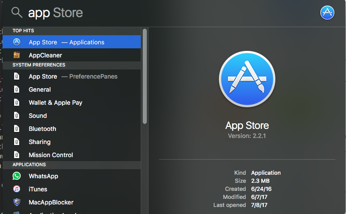
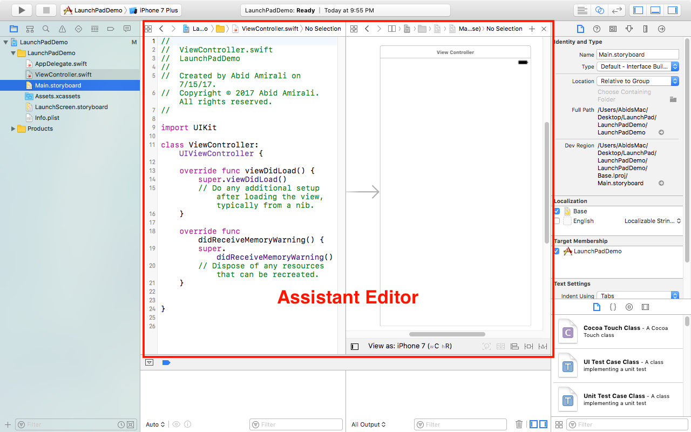

## Introduction to Xcode

Xcode is Apple's is an IDE (Integrated Development Environment) that is primarily used for development of applications for IOS and MacOS. Xcode supports writing in Swift and Objective-C in addition to other common programming languages such as C/C++ or even Java.

### Xcode Installation

To start off with the process of installing Xcode we will simply be going to the Mac App Store. You can find the App Store in your Mac's Application Folder or by simply searching for it like so.

Once you have the App Store open, use the search bar to search for `Xcode`. 

When you have searched for Xcode you should see the following

Select Xcode, your first search result and navigate to its detail view. Once there simply hit install. Note you should see install instead of open.

You should be prompted to enter your credentials. Just enter them and everything else should be done for you. 

### Interface Usage

#### Creating a project

Assuming everything went well you should see the following when you have successfully installed Xcode.

The right pane of the Xcode launch screen shows you your recent projects. If this is your first time working with Xcode this pane should be empty for now. I'm sure you will be filling it up with various projects over the course of LaunchPad. The left pane provides you with three options:

- Create a Playground. Playgrounds are files that allow you to work with swift when testing out *a new concept you learned or demonstrate a swift concept to someone else. We will be working playgrounds in detail later.
- Create a Xcode Project. This is what you’ll be using most of the time when working on Xcode Projects if they don’t exist already. We will be focusing on IOS projects which contains essential code to get an IOS application up a running.
-  Open an existing scm repository. 

For this tutorial we will be going creating a new Xcode project. To create a new project simply select the `Create a new Xcode Project` option. 

Once selected, you will be presented with the following screen.

 Given that we will be building IOS application let’s just select IOS and pick a `Single View Application`. A Single View Application is essentially what the name suggests, it’s an application with only on view. Hit Next to continue.
 
 
 

 
 
You are then brought to the `Product Options Screen` where you state the name of your project. For this tutorial I am going to name my Xcode project LaunchPad Demo. Also pick an organization identifier. This is just used to create a unique identifier for your application. `com.YOURCAREERACCOUNTUSERNAME` would be something you can use. Hit next to continue.

 
 
 
The project settings view is where you can modify any project settings, these range from simple settings like your projects name to what libraries you want to include in your project.  

#### Xcode Interface

Xcode has three editors:

- Standard Editor
- Assistant Editor
- Version Editor

Do note that the only thing that changes as you switch between editors is the the editor view. 

- Standard Editor
 

- Assistant Editor

- Version Editor

### Interacting With Xcode's Object Library

As budding IOS developers you will mostly be interacting with Xcode's Object Library when working on your applications view through the storyboard. Storyboard lets you easily create a User Interface for your application. 

To navigate through the object directory makesure that you have the object library selected in the libraries pane. 

When you open the storyboard, you should see a rectangular block which is just blank. That blank represents the view you are currently creating. The view is simply what we see when we run the application. Let’s try adding a label to blank application. 





To add a label to our view, simple search using the word `label` in search bar at the bottom right of Xcode.

When you do search for a label you should see that your top search result is a label and that is what we wanted to simply drag it into your view. As you finish dragging you should see a text Label pop up on your screen. 

This is what your screen should look like once youre done. Drag and Drop will be the the most common way of how you interact with the Object Library when building your views.

### Running the Simulator

Xcode comes with simulators for all IOS devices that Apple's current mobile operating system supports. These simulators cannot replicate all the functionality of an IOS device but are often handy when you don’t have an IOS device with you.

To run a simulator simply select a device from the set active scheme menu.

For now I'll be simulating an iPhone 5 

Then simply click on the run (the play button) and you should see a simulator pop up. It will set up everything for you and as it sets things up you should see an Apple Logo with a loading bar. 

Once its done setting everything up, you should see your app. Considering that all our application currently includes is a label, its all that is shown on our screen.

